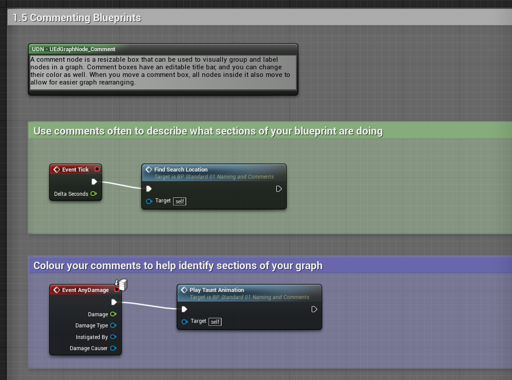
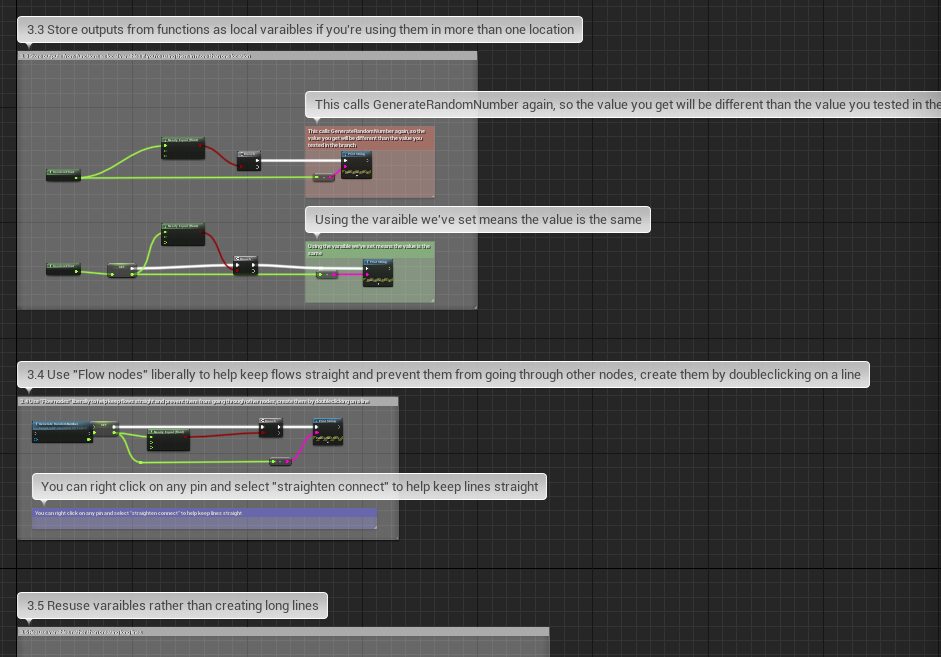
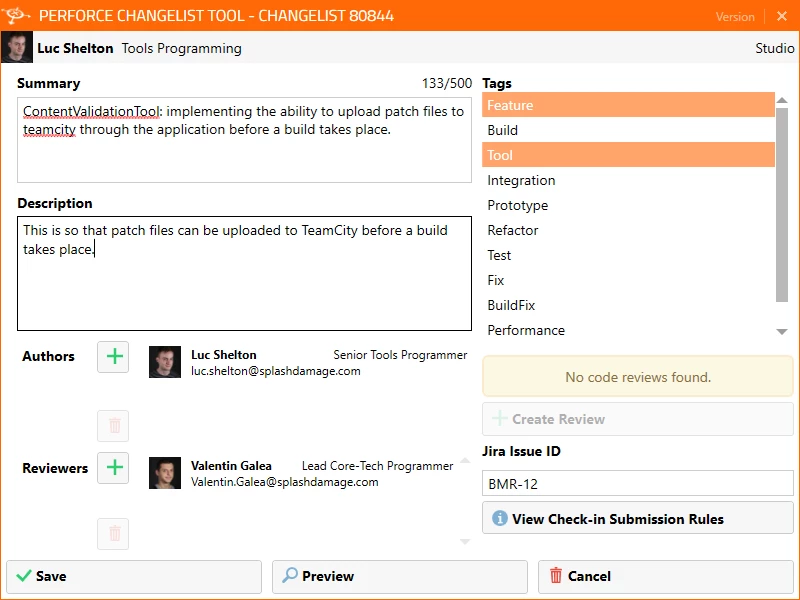

import { CodeSurfer } from "mdx-deck-code-surfer"
import { Appear } from 'mdx-deck'
import { Head } from 'mdx-deck'
import { Image } from 'mdx-deck'
import Box from 'superbox'

export { default as theme } from "./theme"
import code_theme from "prism-react-renderer/themes/vsDark"

<Head><title>How Splash Damage approaches development</title></Head>

export const center_style = {
    position: 'relative',
    top: '50%',
    transform: 'translateY(-50%)'
};

export const title_style = {
    color: 'white',
    textShadow: '-5px 5px 0px rgba(0,0,0,0.45)',
    fontSize: '98px',
    fontWeight: '600'
};

<Image src="img/SD/banner.jpg">
  <Box css={ center_style }>
    <div style={ title_style }>
    Growing a Healthy UE4 Ecosystem:<br/>
    How Splash Damage approaches development
    </div>
  </Box>
</Image>

---
<Image src="img/timeline/sd-timeline-1.jpg" />

---
<Image src="img/timeline/sd-timeline-2.jpg" />

---
<Image src="img/timeline/sd-timeline-3.jpg" />

---
## Agenda

- Teams and Projects
- Standards
- Validation
- Compilation
- Automation & Testing
- Projects Structure
- Splash Engine & Merges

---
## Disclaimer

- Share our learnings
  * what worked well 👍
  * what didn't 👎
- Get inspired!

---
## Teams and Projects

- 300 employees
- Split across multiple ongoing projets
- Most projects use **Splash Engine**
  * vanilla UE4 + own modules and enhancements


---
<Image src="img/UE4/Unreal-Fest-GOW-UE.jpg">
  <Box css={ center_style }>
    <div style={ title_style }>
# Coding Standards
    </div>
  </Box>
</Image>

---
## About

- Usually as standalone documentation (_pdf_, _wiki_, etc)
- People are supposed to study them
  * then apply in practice

---
## Pitfalls

- Grow big / Hard to navigate
- Get _out-of-date_ quickly
- In separate location
  * outside production source code
- Only select few modify or improve them
- Nobody has time to read documentation! 😛

---
## Splash Damage approach

- Standards are **source code files** 📑
  - you can break the build messing with the standard!
- Created and improved through code reviews
- A system for easy _reference_ and _searching_

---
## The Coding Standards

* 2 files
  * `SplashDamageCodingStandard.h`
  * `SplashDamageCodingStandard.cpp`
* Located in the main source code
  * `ue4/Game/Source/Main/...`
* Open Source
  * https://github.com/splash-damage/coding-standards

---


---
<CodeSurfer
  title="The standard"
  code={require("!raw-loader!../standards/snip/overview.h")}
  lang="cpp"
  showNumbers={false}
  theme={code_theme}
  steps={[
    { notes: "the header file" },
    { range: [ 1, 15], notes: "" },
    { lines: [4], notes: "notice the chapter tagging system" },
    { lines: [11] },
    { lines: [14] },
    { range: [15, 30] },
    { range: [30, 45] },
    { range: [45, 60] },
    { range: [61, 66] },
    { lines: [61, 63, 66] },
    { range: [82, 90] },
    { range: [92, 98] }
  ]}
/>

---
## Tagging

- Inspired by the C++ ISO standard itself
  * ex: `21.9.4  Initializer list range`
  * `access [support.initlist.range]`
- Allows easy _search_ and _reference_
- Handy in code reviews

---
## Usage

Applied via code reviews

<br/>


---
## Usage (continued)

Takes the pressure off from feeling judgemental

<br/>


---
## Modify and Improve

The standard itself is changed though reviews sent to the whole team

If enough up-votes the proposal gets submitted 👍

---
<Image src="img/UE4/Unreal-Fest-GOW-4.jpg">
  <Box css={ center_style }>
    <div style={ title_style }>
# Content Standards
    </div>
  </Box>
</Image>

---
## Motivation

- Poor organisation and practices for assets
  * ...compound over time
  * ...waste productivity
  * ...increase cooking and deployment times
- UE4 Editor is easy to modify to
  * improve workflows
  * enforce good practices

---
## Asset naming rules


- less confusion and improves searching & browsing
- `Prefix` and `BaseAssetName` are mandatory

---
## Example


---
## Enforcing

- Automated checker / validator
  * Editor commandlet
  * uses preset JSON list
  * matches asset type against name
- Intercept new asset creation

---
<CodeSurfer
  title="Asset naming definitions"
  code={require("!raw-loader!../flow/asset-naming.txt")}
  theme={code_theme}
  lang="yaml"
  steps={[
    { notes: "" },
    { range: [ 3, 6] },
    { range: [15, 18] },
    { range: [27, 30] },
    { range: [43, 46] }
  ]}
/>

---
## Enforcing (cont.)


---
## Blueprint Standards

- Same principles as the Coding Standard
- Live in `Game/Content/Standard/`
- We have some basic automatic validators
- Best gain for us:
  * enforcing comment nodes

---



---



---
<Image src="img/UE4/Unreal-Fest-GOW-5.jpg">
  <Box css={ center_style }>
    <div style={ title_style }>
# Content Validation
    </div>
  </Box>
</Image>

---
## Automated Validation

- CI (Continuous Integration) support
  * validation after submit
  * nightly builds
- Blueprints Validation
- Assets Validation

---
## Blueprints Validation

- Editor commandlet
- Basic checks
  * comment nodes present
  * public functions / vars must have tooltips
  * no functions / vars with default names
- Future work / ideas
  * leverage the Blueprint Compiler
  * more complex checks

---
## Assets Validation 

- Checks for bad or missing references
  * disregards *Developer*, *Test* folders
- Executed via cooking:
  * `-COOKALL -DUMPALLWARNINGS -WARNINGSASERRORS`
  * ⚠️ 
  * not viable for large projects
    * explore other possibilities
    * ex: dependency walker via Asset Registry

---
<Image src="img/UE4/Unreal-Fest-GOW-T.jpg">
  <Box css={ center_style }>
    <div style={ title_style }>
# Compilation
    </div>
  </Box>
</Image>

---
## Hardware

- Everyday work is very CPU intensive
- CPU hardware threads
  * jump from 8 to 16 substantial (2x)
  * same from 16 to 32
  * dimishing returns after
- Distributed compilation
  * _Incredibuild_ for some projects
  * we also tried _Fastbuild_
    * free but more difficult to integrate

---
## Build Farm

- Configuration / layout different per project
- Sweetspot price / performance for us 32 thread CPUs
  * Good performer: 16c/32t AMD Threadripper 1950x
- Orchestration
  * _TeamCity_ - most projects
  * _Jenkins_

---
## Infrastructure-As-Code

- In the past we used ad-hoc methods that didn't scale well
  * too tight integrated with the CI orchestrator
  * too bespoke for a project - cannot reuse
  * hard to debug locally
- Now leveraging Epic's own _BuildGraph_

---
## BuildGraph

- Alternative to traditional `BuildCookRun` automation commands
- XML based scripts

* How we use it
  * standardized and reusable set of scripts
  * unifies all calling paths
    * Visual Studio
    * Editor - Hot Reload
    * command line
    * CI systems

---
## BuildGraph (cont.)

- Additional benefits
  * easier edit in Visual Studio than batch files
  * allows build tasks parallelizing
  * easier dependencies management
- Our most complex use-cases:
  * prepare Unreal Game Sync editor binaries
  * code/data submit-dependency flagging

TODO: maybe talk UBT/UAT in P4 (pre-commit for them)

---
<CodeSurfer
  title="BuildGraph (example)"
  code={require("!raw-loader!../flow/buildgraph.xml")}
  theme={code_theme}
  lang="xml"
  steps={[
    { notes: "" },
    { range: [ 7,  8] },
    { range: [13, 14] },
    { range: [18, 23] },
    { lines: [ 34 ] },
    { range: [53, 59] },
    { range: [73, 79] },
    { range: [132, 141] }
  ]}
/>

---
# Pre-Commit

---
<CodeSurfer
  title="Normal Commit Flow"
  code={require("!raw-loader!../flow/submit.txt")}
  theme={code_theme}
  lang="yaml"
  steps={[
    { notes: "" },
    { range: [ 1,  5] },
    { range: [10, 15] },
    { range: [23, 28] },
    { range: [36, 41] }
  ]}
/>

---
<CodeSurfer
  title="Pre-Commit Flow"
  code={require("!raw-loader!../flow/pre-submit.txt")}
  theme={code_theme}
  lang="yaml"
  steps={[
    { notes: "" },
    { range: [ 1,  5] },
    { range: [10, 15] },
    { range: [23, 28] },
    { range: [36, 41] },
    { lines: [43, 47] },
    { range: [50, 53] },
    { range: [62, 66] },
  ]}
/>

---
## How it works

- Effectively 2 systems working together
- Frontend
  * what the devs interact with
- Backend
  * CI / build-machines

---
## Pre-Commit Frontend

- Tools that allow indirect submits to main code base
- Off-the-shelf
  * Visual Studio ReSharper Team City plugin
  * https://www.jetbrains.com/resharper/
- Internally developed
  * more project specific
  * written in C# or Python  

---
## Example: Visual Studio ReSharper

<div style={{float: "left", display: "inline", textAlign: "left"}}>
<br/>
<br/>
Build configurations<br/>
to check against ----------------------------------<br/>
<br/>
<br/>
<br/>
<br/>
<br/>
<br/>
<br/>
Options to auto-commit<br/>
only on success -----------------------------------
</div>


---
## Pre-Commit Backend

- *Personal Build* system
  * starts CI build configuration in isolation
  * more configurations -> better coverage 😊️
  * more configurations -> stress on build farm ☹️
- Compile time-saving solution
  * rebuild all participating configuration nightly
  * incremental (non-unity) builds throughout the day
  * example:
    * _Editor_ + _Game(PC)_ + _Game(PS4)_
    * Overnight: 1.5-2h on fastest machine
    * Daily: 5-15 min per commit check

---
## Workflow & Rules

- Every commit validated against:
  * Has _title_ and _description_
  * Contains at least of _tag_ like `[Feature]` `[Bug]` `[Merge]` etc
  * Has links to _code review_ or code _buddies_
  * Time-limits to prevent commit-and-runs
- Some projects relax or constrain the rules more
  * example: check against known build-breaking patterns
    * (missing .h/.cpp pair)

---
## Validation



---
## Validation (contd.)


---
# Automation & Testing

---
## Unit Testing

- Testing plain classes and structs or single UObjects
- Enhancements to UE4's own framework
  - follow Given / When / Then structure
  - separate standards file 
  - integrated with CI (ex: TeamCity)
  - utilities
    * import private data from testable modules
    * `UWorld` setup & teardown

---
<CodeSurfer
  title="Unit Test Example"
  code={require("!raw-loader!../flow/testing.cpp")}
  theme={code_theme}
  lang="cpp"
  steps={[
    { notes: "" },
    { range: [ 8, 10], notes: "syntactic sugar macros" },
    { range: [52, 53], notes: "test names must follow specific naming" },
    { range: [54, 58], notes: "Given..." },
    { range: [65, 67], notes: "...When..." },
    { range: [69, 72], notes: "...Then" },
    { range: [77, 79], notes: "cleanup" }
  ]}
/>

---
## Functional Testing

- Blueprint actors that we embed in bespoke levels using the editor
- Live under `Game/Content/Test/...`
- Named `FTEST_` to follow Epic's convention and for visibility
- Not network capable
  * Look into recent UE4 additions: _Gauntlet_

---
## CI Tests Integration


---
## Editor automation

- UnrealGameSync (UGS)
  * distributing Editor binaries is a more controlled manner
  * very useful for non-programmers
    * we stripped out the compilation support
  * we refactored the packaging script via BuildGraph
    * more control, adding symbols upload
- Basic automated Editor validation
  * build machine boots freshly compiled Editor
  * watches for crashes by monitoring logs

SLIDE: split in 2 slides
WORK: get info on editor run problems

---
# Projects Setup

---
## Game Modules

- We strive to have multiple independent modules
  * as opposed to 1 monolithic one
- Beneficial for
  * encapsulation and architecture
  * faster iteration (linkage improvement for ex)
  * support for Hot-Reload
  * re-use throughout projects

---
<CodeSurfer
  title="Game Module Layout Example"
  code={require("!raw-loader!../flow/modules.txt")}
  theme={code_theme}
  lang="yaml"
  steps={[
    { notes: "" },
    { range: [ 2, 14], notes: "Runtime module" },
    { range: [16, 26], notes: "Test module" },
    { lines: [3], notes: "UBT build file" },
    { range: [5, 8], notes: "Implementation" },
    { range: [10, 14], notes: "Interface" }
  ]}
/>

SLIDE: maybe add more modules examples

---
<CodeSurfer
  title="Game Module Layout Example"
  code={require("!raw-loader!../flow/gen-module.txt")}
  theme={code_theme}
  lang="bash"
  steps={[
    { notes: "" },
    { range: [ 4, 11], notes: "ASCII art!" },
    { range: [23, 28], notes: "user choices" },
    { range: [53, 58], notes: "creating folder structure" },
    { range: [105, 114], notes: "creating build file" },
    { range: [123, 128], notes: "creating build file" }
  ]}
/>

---
# Splash Engine

---
## About

We extract and re-use the UE work across projects into "Splash Engine"

- game-agnostic engine enhacements & fixes gathered across time
- re-usable mini-frameworks modules
  * UI components
  * Audio thin abstractions
  * Events, Async Tasks
  * Rendering features
  * Tech-Art utilities
    * ex: Instance Mesh split /group

---
## Overview

- Majority of projects get seeded from "Splash Engine"
- Downstream integrations
  * "Splash Engine" tends to be at latest UE4 version
  * projects update at their own pace
- Upstream integrations
  * some projects will bubble-up important features

---
export const arch_A = 5
export const arch_B = 34
export const arch_C = 64

<CodeSurfer
  title="Architecture"
  code={require("!raw-loader!../flow/splash-engine.txt")}
  theme={code_theme}
  lang="yaml"
  steps={[
    { notes: "" },
    { lines: [ arch_A+0 ], notes: "master Perforce depot" },
    { lines: [ arch_A+2 ], notes: "engine 'vanilla' drops from Epic" },
    { lines: [ arch_A+5 ], notes: "Splash Engine" },
    { range: [ arch_A+8, arch_A+11], notes: "company games/projects" },
    { range: [ arch_B+2, arch_B+6 ], notes: "individual downloaded versions" },
    { range: [ arch_C+1, arch_C+7], notes: "Splash Engine layout" },
    {   lines: [ arch_C+3 ], notes: "'vanilla' version for merge diff" },
    {   lines: [ arch_C+4 ], notes: "master branch" },
    { range: [ arch_C+5, arch_C+8 ], notes: "individual project staging" }
  ]}
/>

---
## Merge Scenario

Updating a game project to latest UE4 version...

---
## Starting structure

```
/splash-ue4                                             
|
├───/clean
│   
│
├───/main
|
|
├───/project-A
├───/project-B
├───...
```

---
```
/splash-ue4                 |                            
|                           |
├───/clean  <---------------'  copy latest UE version
│                              (allows nice incremental diffs)
│
├───/main
|
|
├───/project-A
├───/project-B
├───...
```

---
```
/splash-ue4                                             
|
├───/clean -----------------.
│                           |  merge across to main branch
│                           |  (also update any plugins we use)
├───/main  <----------------'
|
|
├───/project-A
├───/project-B
├───...
```

---
```
/splash-ue4                                             
|
├───/clean
│   
│
├───/main
|
|
├───/project-A  <-----------. 
├───/project-B              |
├───...                     |  merge from main game repo
                            |  (prepare staging area with latest game advances)
```

---
```
/splash-ue4                                             
|
├───/clean
│   
│
├───/main ------------------.
|                           |  merge latest engine to game staging
|                           |  (solve conflicts in isolation from game project)
├───/project-A <------------'
├───/project-B
├───...
```

---
```
/splash-ue4                                             
|
├───/clean
│   
│
├───/main
|
|
├───/project-A  >-----------. 
├───/project-B              |
├───...                     |  merge from staging to game project
                            |  (game project now updated to latest UE)
```

---
## Summary

- Allows us to have quick integrations
- Decouples main game dev work from integration work
- Keeps "Splash Engine" updated and in good condition

---
## The End

@valentin_galea

  

splashdamage.com

---
## Tasks

SYS: find solution for incremental lists 
SYS: try embed code-surfer in react.js
SYS: find solution for header/footer https://github.com/kyleshevlin/react-edges
SYS: code-surfer change font size https://github.com/pomber/code-surfer/pull/52/commits/f5a5bab0bef47a494b376f01c297c10b4614db97
SYS: patch for W:\Dev\OpenSource\research_work\mdx\node_modules\mdx-deck-code-surfer\dist\deck-code-surfer.js line 51
SYS: fix html export

DECK: change theme to white or bigger impact black
DECK: increase margin for img's
DECK: change anchor colors
DECK: change `` colors
DECK: use the orange text color rule from the marketing guide
DECK: add black box for title slides

TODO: attrib icon
TODO: thanks to the team
TODO: about me page
TODO: more pre-amble about the coding standard -> that it's UE4 heavy
TODO: insert back coding actor
TODO: blueprint standard validation confusing before showing them
TODO: move the asset naming out of def and into validation (maybe add back the dir structure)
TODO: buildgraph code / data depend remove (too complicated to explain)
TODO: expand more on the macro test
TODO: hard transition from game module layout to batch file
TODO: code-surfer: change title for h2 to smaller and increase the notes font size

WORK: talk to Mark V about TA tools
WORK: get more/better chapter imgs
WORK: talk to Sylvain to check on projector

<div>Icons made by <a href="https://www.flaticon.com/authors/eucalyp" title="Eucalyp">Eucalyp</a> from <a href="https://www.flaticon.com/" 			    title="Flaticon">www.flaticon.com</a> is licensed by <a href="http://creativecommons.org/licenses/by/3.0/" 			    title="Creative Commons BY 3.0" target="_blank">CC 3.0 BY</a></div>